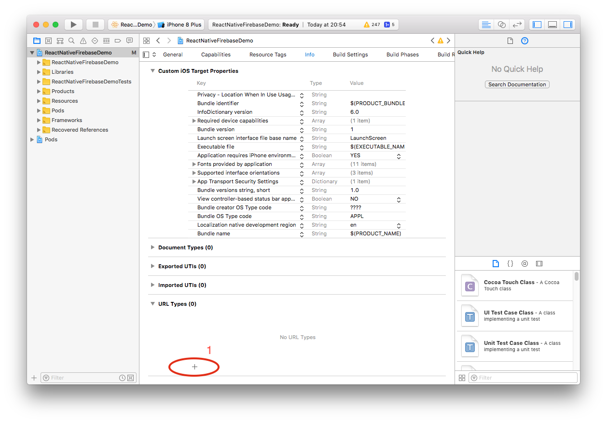
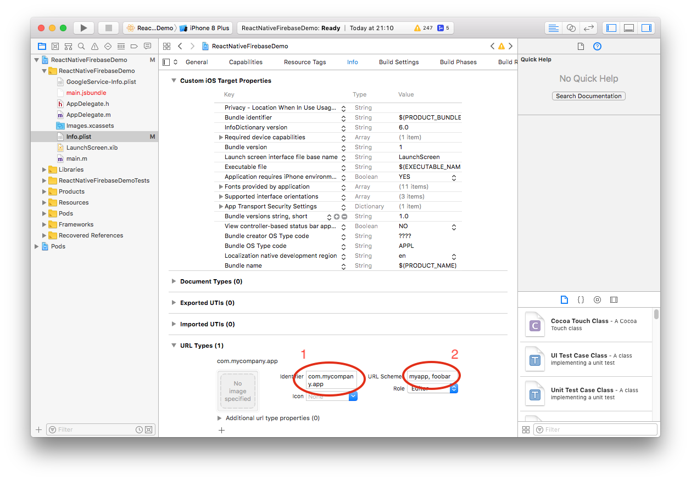

# Create a URL Type and Scheme

After navigating to the URL Types section of your Xcode workspace you can now add a new URL type and specify it's

## Add new URL type (+)

1. Click the `Add items` plus (`+`) icon at the bottom of the URL Types section: 

## Configure the new URL Type

Steps as shown in image below:

 1. Input the `Identifier` value 
    > The `Identifier` is normally the same as your `Bundle Identifier` which is usually the reverse of the domain for your app e.g. `com.mycompany.app`.
 2. Input the `URL Schemes` value - this can be a comma delimited list of values 
    > For example if you set this to `myapp,foobar` then your app will then accept urls from `myapp://*` and `foobar://*`.
 
 `Icon` and `Role` can be left to use the defaults unless you need to change these.
 
 
 
 