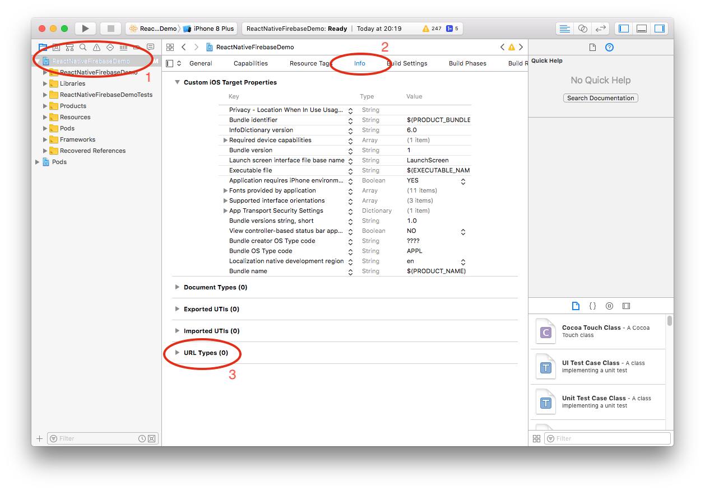

# Getting Started

This short beginners Codorial will guide you through creating a custom iOS URL Scheme in your Xcode project.

## Prerequisites

This Codorial assumes you have the following installed on your Mac:

 - [Xcode](https://developer.apple.com/xcode/)
 - [CocoaPods](https://cocoapods.org/)
    - CocoaPods is a dependency manager for Swift and Objective-C Cocoa projects.

## Open your project's `.xcworkspace` file

Open your project's `.xcworkspace` file with Xcode

> The `.xcworkspace` file is normally generated by CocoaPods after running `pod install` in your ios project directory.

## Navigate to URL Types

Steps as shown in image below:

   1. Select your project on left hand side file tree
   2. Select the `Info` tab on the middle pane
   3. Expand the `URL Types` section header
   
   
